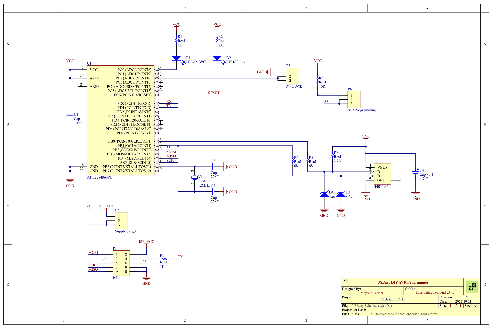

# USBasp DIY AVR Programmer

Designed and built for University of Zanjan Robotics Association in 2015

The design is based on: [USBasp - USB programmer for Atmel AVR controllers](https://www.fischl.de/usbasp/)

